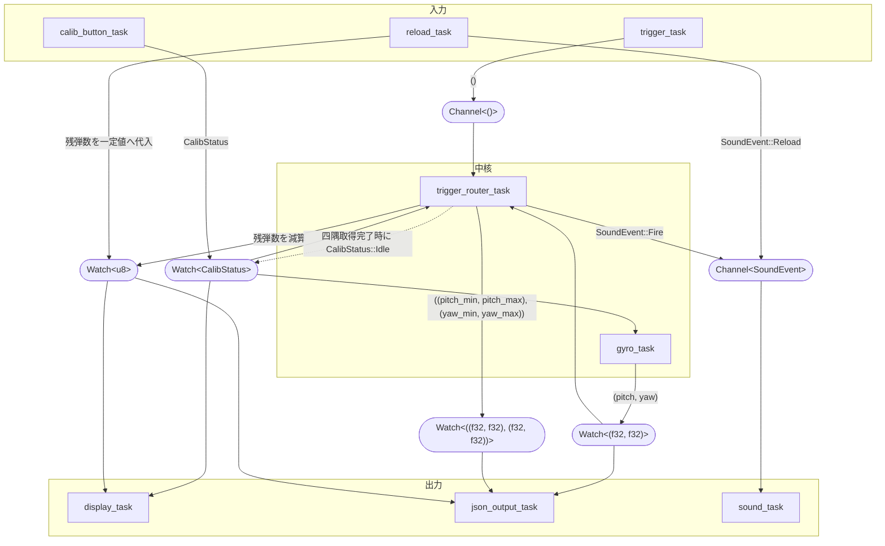

# funfes2026-controller

大学祭（未来祭2026）で展示予定のシューティングゲーム向けコントローラーの、組み込み側（ファームウェア）リポジトリです。

M5Stack StickS3 上で動作し、内蔵ジャイロセンサーによる照準操作とトリガー/リロード入力を読み取り、USBシリアル経由でPC(Unity)側に送信します。PC側の受信・ゲーム本体はこのリポジトリには含まれません。

## 出力

コントローラーからPC(Unity)へ、USBシリアル経由でJSON（改行区切り、1行1メッセージ）を一方向に送信します。ACK等のハンドシェイクはありません。約1秒間隔（`Ticker::every(1000ms)`）で送信されます。

```json
{"x": 0.5, "y": 0.5, "ammo": 5}
```

| フィールド | 型 | 内容 |
| --- | --- | --- |
| `x` | `f32` | 照準の左右位置。キャリブレーション範囲に対する正規化値（左端が `0.0`、右端が `1.0`）で、範囲外は `0.0`〜`1.0` にクランプされる |
| `y` | `f32` | 照準の上下位置。左下原点で `0.0`〜`1.0`（下端が `0.0`、上端が `1.0`）に正規化され、同様にクランプされる |
| `ammo` | `u8` | 残弾数 |

## 使用技術

- 言語: [Rust](https://www.rust-lang.org/)（`no_std` / `no_main`）
- マイコン: M5Stack StickS3 (ESP32-S3-PICO-1-N8R8 / IMU: BMI270)
- HAL: [esp-hal](https://github.com/esp-rs/esp-hal)
- 実行環境: [esp-rtos](https://github.com/esp-rs/esp-hal)（embassy executor）
- IMUドライバ: [`bmi2`](https://crates.io/crates/bmi2)

## 使い方

### 必要環境

- ESP32-S3向けのRustツールチェーン（[esp-rs](https://github.com/esp-rs/rust-build)。`rust-toolchain.toml` で `channel = "esp"` を指定済み）
- [`espflash`](https://github.com/esp-rs/espflash)

### ビルド

```bash
cargo build --release
```

### 書き込み・実行

```bash
cargo run --release
```

`.cargo/config.toml` で `espflash flash --monitor` がランナーとして設定されているため、ビルド後に自動で書き込み・シリアルモニタ起動まで行われます。

### ジャイロ動作確認用バイナリ

ジャイロの読み取り値をシリアル出力で確認できる単体テスト的なバイナリです。

```bash
cargo run --bin gyro
```

## ハードウェア

- マイコン: M5Stack StickS3
- 入力: マイクロスイッチ（トリガー・リロード用）
- 基板・筐体: **未定**

---

# タスク設計



トリガー入力の意味（発砲 / キャリブレーション操作）は `CalibStatus` によって変わるため、`trigger_task` からの入力は `trigger_router_task` が一箇所で受け、現在の `CalibStatus` を見て振り分ける:

- `Idle`: 残弾数を減算し（`ammo_watch`）、`SoundEvent::Fire` を送出（通常の発砲）
- `Running(Orientation)`: その時点のジャイロ角度を画面四隅の1点として記録し、4点集まったら pitch/yaw それぞれの `(min, max)` を `calib_range_watch` に送出したうえで `CalibStatus::Idle` に戻す
- それ以外（`Selecting` / `Running(Stationary)`）: 無視

`reload_task` は残弾数を一定値へ代入し、`SoundEvent::Reload` を送出する。`display_task` / `sound_task` は残弾数・状態やサウンドイベントにのみ反応するため、ジャイロ角度・キャリブレーション範囲は購読しない。角度の0〜1正規化は `json_output_task` が自身の出力タイミングでのみ、`gyro_watch` の最新角度と `calib_range_watch` の `(min, max)` から都度計算する（ジャイロの取得間隔ごとに計算し続けることはしない）。
