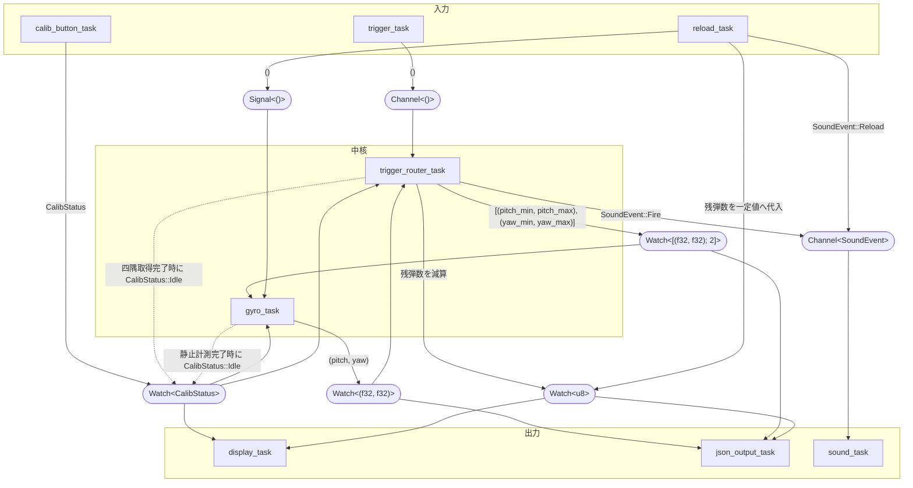

# funfes2026-controller

大学祭（未来祭2026）で展示予定のシューティングゲーム向けコントローラーの、組み込み側（ファームウェア）リポジトリです。

M5Stack StickS3 上で動作し、内蔵ジャイロセンサーによる照準操作とトリガー/リロード入力を読み取り、USBシリアル経由でPC(Unity)側に送信します。あわせて、残弾数の表示（内蔵LCD）と発砲音の再生（内蔵スピーカー）もコントローラー側で行います。PC側の受信・ゲーム本体はこのリポジトリには含まれません。

## 出力

コントローラーからPC(Unity)へ、USBシリアル経由でJSON（改行区切り、1行1メッセージ）を一方向に送信します。ACK等のハンドシェイクはありません。

送信周期はビルドプロファイルで切り替わります（`src/output.rs` の `D`）。リリースビルドは20ms間隔、デバッグビルドは1秒間隔で、デバッグ時は `debug_println!` のログと混ざって読みにくくなるため周期を落としてあります。

```json
{"x": 0.5, "y": 0.5, "ammo": 5}
```

| フィールド | 型 | 内容 |
| --- | --- | --- |
| `x` | `f32` | `gyro_watch` の1つ目の角度（pitch）を、四隅キャリブレーションで得た pitch の `(min, max)` で `0.0`〜`1.0` に正規化した値（min が `0.0`、max が `1.0`）。範囲外はクランプされる |
| `y` | `f32` | `gyro_watch` の2つ目の角度（yaw）を、yaw の `(min, max)` で正規化した値。向きは反転しており、max が `0.0`、min が `1.0`。範囲外はクランプされる |
| `ammo` | `u8` | 残弾数（満タンは9発） |

正規化は `json_output_task` が自身の送信タイミングでのみ、`gyro_watch` の最新角度と四隅キャリブレーションで得た `(min, max)` から都度計算します。四隅キャリブレーションが済むまで送信は始まりません。

## 画面表示・効果音

- 画面（内蔵LCD、135x240）: 通常時（`CalibStatus::Idle`）は残弾数を7セグメント風に大きく表示し、残弾0では赤く切り替わります。キャリブレーション中は状態ごとのタイトルと操作説明を表示します。描画は `Screen` が残弾数・状態の変化を検知したときだけ行い、変化がなければ待機します。
- 音（内蔵スピーカー、ES8311 + I2S）: 発砲時に `assets/shot.wav` を再生します。再生中に新しいイベントが来た場合は打ち切って鳴らし直します。リロード音は音源が未用意のため未実装です（`SoundEvent::Reload` は受け取るが何も鳴らさない）。

## 操作

起動直後に静止キャリブレーション（ジャイロのドリフト量測定。100サンプル、約1秒）が走り、完了すると続けて四隅キャリブレーションに入ります。四隅が揃うと通常状態（`CalibStatus::Idle`）になり、JSON送信が始まります。

| 操作 | 状態 | 動作 |
| --- | --- | --- |
| トリガー | `Idle` | 残弾を1発消費して発砲音を鳴らす（残弾0では何もしない） |
| トリガー | `Running(Orientation)` | そのときの向きを画面四隅の1点として記録する（4回で完了） |
| リロードボタン | 残弾0のときのみ | 残弾を満タン（9発）に戻し、同時にいま向いている方向を出力の中心 `(0.5, 0.5)` に取り直す |
| キャリブボタン長押し（1秒以上） | `Idle` | `Selecting`（キャリブレーション種別の選択）へ |
| キャリブボタン短押し（50ms〜1秒） | `Selecting` | 四隅キャリブレーション開始 |
| キャリブボタン長押し（1秒以上） | `Selecting` | 静止キャリブレーション開始 |

50ms未満の押下は無視されます。

リロード時のリセンターは、ジャイロの角度積分に溜まった誤差を遊技中に捨てるための仕組みです。四隅キャリブレーションが済んでいない間は基準が無いため何もしません。

## 技術スタック

- 言語: [Rust](https://www.rust-lang.org/)（`no_std` / `no_main`）
- マイコン: M5Stack StickS3 (ESP32-S3-PICO-1-N8R8 / IMU: BMI270)
- HAL: [esp-hal](https://github.com/esp-rs/esp-hal)
- 実行環境: [esp-rtos](https://github.com/esp-rs/esp-hal)（embassy executor）
- IMUドライバ: [`bmi2`](https://crates.io/crates/bmi2)
- 画面: [`mipidsi`](https://crates.io/crates/mipidsi)（ST7789）+ [`embedded-graphics`](https://crates.io/crates/embedded-graphics) + [`embedded-hal-bus`](https://crates.io/crates/embedded-hal-bus)
- 音声: [`es8311`](https://crates.io/crates/es8311)（コーデック制御）+ esp-hal の I2S/DMA

## 使い方

### 必要環境

- ESP32-S3向けのRustツールチェーン（[esp-rs](https://github.com/esp-rs/rust-build)。`rust-toolchain.toml` で `channel = "esp"` を指定済み）
- [`espflash`](https://github.com/esp-rs/espflash)
- `assets/shot.wav`（発砲音。音源は非公開のためリポジトリには含めていない。`include_bytes!` で埋め込むため、無いとビルドが通らない）

wavは16kHz / 16bit / モノラルに変換して置きます。

```bash
ffmpeg -i in.mp3 -ac 1 -ar 16000 -sample_fmt s16 -map_metadata -1 -f wav assets/shot.wav
```

### ビルド

```bash
cargo build --release
```

### 書き込み・実行

```bash
cargo run --release
```

`.cargo/config.toml` で `espflash flash --monitor` がランナーとして設定されているため、ビルド後に自動で書き込み・シリアルモニタ起動まで行われます。

### ジャイロ動作確認用バイナリ

ジャイロの読み取り値をシリアル出力で確認できる単体テスト的なバイナリです。

```bash
cargo run --example gyro
```

## ハードウェア

- マイコン: M5Stack StickS3（LCD・スピーカー・IMUは内蔵のものを使用）
- 入力: マイクロスイッチ（トリガー・リロード用）

ピン割り当て（`src/bin/main.rs` に定義）:

| 用途 | ピン |
| --- | --- |
| トリガー | GPIO9 |
| キャリブボタン | GPIO11 |
| リロードボタン | GPIO10 |
| IMU (I2C) | SDA: GPIO47 / SCL: GPIO48 |
| LCD (SPI2) | SCLK: GPIO40 / MOSI: GPIO39 / CS: GPIO41 / DC: GPIO45 / RST: GPIO21 / バックライト: GPIO38 |
| スピーカー (I2S) | MCLK: GPIO18 / BCLK: GPIO17 / WS: GPIO15 / DOUT: GPIO14 |

---

# タスク設計


```mermaid
flowchart TD
    subgraph input["入力"]
        trigger_task
        reload_task
        calib_button_task
    end

    subgraph core["中核"]
        gyro_task
        trigger_router_task
    end

    subgraph output["出力"]
        display_task
        json_output_task
        sound_task
    end

    trigger_task -- "()" --> trigger_ch(["Channel&lt;()&gt;"])
    trigger_ch --> trigger_router_task

    calib_button_task -- "CalibStatus" --> calib_watch(["Watch&lt;CalibStatus&gt;"])
    calib_watch --> gyro_task
    calib_watch --> trigger_router_task
    calib_watch --> display_task

    gyro_task -- "(pitch, yaw)" --> gyro_watch(["Watch&lt;(f32, f32)&gt;"])
    gyro_watch --> trigger_router_task
    gyro_watch --> json_output_task

    trigger_router_task -- "[(pitch_min, pitch_max), (yaw_min, yaw_max)]" --> orientation_range_watch(["Watch&lt;[(f32, f32); 2]&gt;"])
    orientation_range_watch --> json_output_task
    orientation_range_watch --> gyro_task

    trigger_router_task -- "残弾数を減算" --> ammo_watch(["Watch&lt;u8&gt;"])
    reload_task -- "残弾数を一定値へ代入" --> ammo_watch
    ammo_watch --> display_task
    ammo_watch --> json_output_task

    trigger_router_task -. "四隅取得完了時に CalibStatus::Idle" .-> calib_watch
    gyro_task -. "静止計測完了時に CalibStatus::Idle" .-> calib_watch

    reload_task -- "()" --> recenter_signal(["Signal&lt;()&gt;"])
    recenter_signal --> gyro_task

    trigger_router_task -- "SoundEvent::Fire" --> sound_event(["Channel&lt;SoundEvent&gt;"])
    reload_task -- "SoundEvent::Reload" --> sound_event
    sound_event --> sound_task
```

トリガー入力の意味（発砲 / キャリブレーション操作）は `CalibStatus` によって変わるため、`trigger_task` からの入力は `trigger_router_task` が一箇所で受け、現在の `CalibStatus` を見て振り分ける:

- `Idle`: 残弾が1以上なら残弾数を減算し（`ammo_watch`）、`SoundEvent::Fire` を送出（通常の発砲）。残弾0なら何もしない
- `Running(Orientation)`: その時点のジャイロ角度を画面四隅の1点として記録し、4点集まったら pitch/yaw それぞれを昇順に並べ、下位2点の平均を min、上位2点の平均を max として `orientation_range_watch` に送出したうえで `CalibStatus::Idle` に戻す
- それ以外（`Selecting` / `Running(Stationary)`）: 無視

`reload_task` は残弾0のときだけ残弾数を一定値へ代入し、`SoundEvent::Reload` と `recenter_signal` を送出する。`gyro_task` は `recenter_signal` を受けると `orientation_range_watch` の `(min, max)` の中央値へ積分角度を打ち直すので、キャリブレーション範囲を読むのは `gyro_task` と `json_output_task` の2つになる。`display_task` / `sound_task` は残弾数・状態やサウンドイベントにのみ反応するため、ジャイロ角度・キャリブレーション範囲は購読しない。角度の0〜1正規化は `json_output_task` が自身の出力タイミングでのみ計算する（ジャイロの取得間隔ごとに計算し続けることはしない）。

`Watch` の受信者数は用途ごとに `src/types.rs` の型エイリアス（`CalibWatch` / `OrientationRangeWatch` など）にまとめてある。受信者を増やすときはこの定数を直す。
